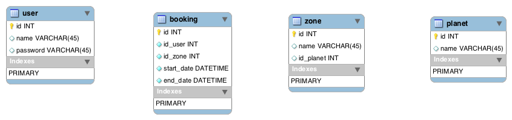

```sql
SELECT 
    b.`start_date`,
    b.`end_date`,
    p.`name` as pname,
    z.`name` zname,
    u.`name` uname

FROM 
    `booking` b
JOIN `user` u ON u.`id` = b.`id_user`
JOIN `zone` z ON z.`id` = b.`id_zone`
JOIN `planet` p ON p.`id` = z.`id_planet`
```

```sql
CREATE TABLE `user` (
  `id` int(10) unsigned NOT NULL AUTO_INCREMENT,
  `name` varchar(45) COLLATE utf8mb4_unicode_ci DEFAULT NULL,
  `password` varchar(45) COLLATE utf8mb4_unicode_ci DEFAULT NULL,
  PRIMARY KEY (`id`)
) ENGINE=InnoDB AUTO_INCREMENT=3 DEFAULT CHARSET=utf8mb4 COLLATE=utf8mb4_unicode_ci;

CREATE TABLE `booking` (
  `id` int(10) unsigned NOT NULL AUTO_INCREMENT,
  `id_user` int(11) NOT NULL,
  `id_zone` int(11) NOT NULL,
  `start_date` datetime NOT NULL,
  `end_date` datetime NOT NULL,
  PRIMARY KEY (`id`)
) ENGINE=InnoDB AUTO_INCREMENT=2 DEFAULT CHARSET=utf8mb4 COLLATE=utf8mb4_unicode_ci;

CREATE TABLE `planet` (
  `id` int(10) unsigned NOT NULL AUTO_INCREMENT,
  `name` varchar(45) COLLATE utf8mb4_unicode_ci DEFAULT NULL,
  PRIMARY KEY (`id`)
) ENGINE=InnoDB AUTO_INCREMENT=5 DEFAULT CHARSET=utf8mb4 COLLATE=utf8mb4_unicode_ci;

CREATE TABLE `zone` (
  `id` int(10) unsigned NOT NULL AUTO_INCREMENT,
  `name` varchar(45) COLLATE utf8mb4_unicode_ci DEFAULT NULL,
  `id_planet` int(11) DEFAULT NULL,
  PRIMARY KEY (`id`)
) ENGINE=InnoDB AUTO_INCREMENT=7 DEFAULT CHARSET=utf8mb4 COLLATE=utf8mb4_unicode_ci;
```
